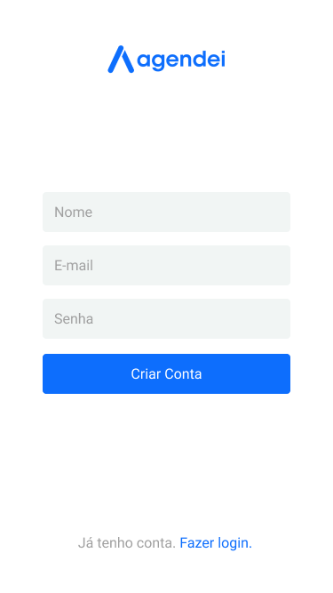
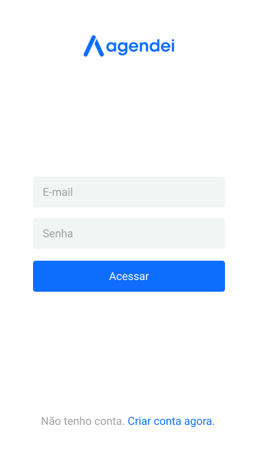
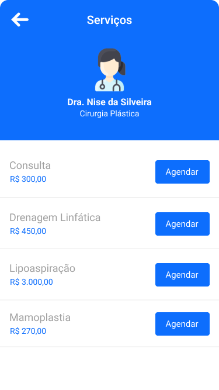
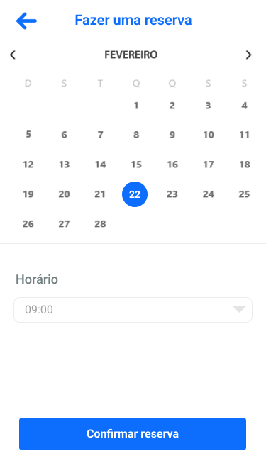

## Projeto
Um aplicativo de marcação de consultas clinica médica ficiticia para um 

O aplicativo ou sistema web deve possuir funcionalidades que permitam o cadastro de médicos e de pacientes, e também o agendamento e cancelamento de consultas.

<!-- Esse projeto é o desenvolvimento da API Rest. -->

## Imagem do Projeto

 <p align="center">
  
</p>

 <p align="center">
  
</p>


<div>
 <p display="grid">
  
</p>
 <p >
  
</p>
 <p >
  
</p> 
<p >
  
</p>
 <p>
  
</p>


</div>


## ⚙️ Funcionalidades

- [x] CRUD de médicos;
- [x] CRUD de pacientes;
- [x] Agendamento de consultas;
- [x] Cancelamento de consultas.


## 🛠 Tecnologias utilizadas

React-Native.js

## Para Clonar o projeto
https://github.com/JacquelineCasali/Api-Sistema-Medico-Java.git


## Instalação e Rodar o Projeto

## FRONTEND

1. `$ npm install`
2. `$ npx expo start`


# 📁 Acessar a aplicação


<!-- ## 👨🏻‍💻 Autenticação

##### Acesse o método POST /login e pressione o botão "Try Out"
##### Email e senha disponíveis para execução:
```java
[
   {
     "email":"ana.souza@voll.med",
     "senha":"123456"
   }
]
``` -->
